

## Introduction

Duplicati is an open source backup application, which runs on your local machine, and encrypts data prior to uploading it. The user interface is web-based and allows you to control all the options offered by Duplicati, from a simple and intuitive interface. 

This guide assumes you have already installed Duplicati, and are about to set up your very first backup.

## 1. The home screen

On the home screen, click the &quot;Add backup&quot; then select "Configure a new backup" and click "Next" to start.

  <a href="../../images/quick-guide/home-empty.png" data-sub-html="The empty home screen. Click the &quot;Add backup&quot; menu to get started">
      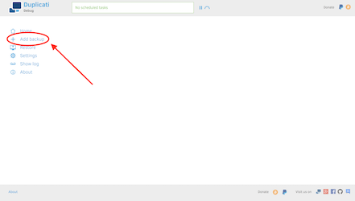
  </a>

### Mobile devices and small screens.

On devices with small screens, the menu is located top-right, and needs an extra click to show.

  <a href="../../images/quick-guide/small-home-no-menu.png" data-sub-html="The empty home screen on a small display. Click the menu icon near the top to see the menu.">
      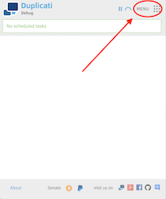
  </a>

  <a href="../../images/quick-guide/small-home-with-menu.png" data-sub-html="The &quot;Add backup&quot; menu on a small display">
      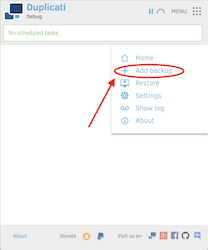
  </a>

## 2. Choose how to add the backup

On the initial page, we choose the default "Configure a new backup" and click the "Next" button.

  <a href="../../images/quick-guide/page0.png" data-sub-html="Adding a new backup; click the &quot;Next&quot; button to continue">
      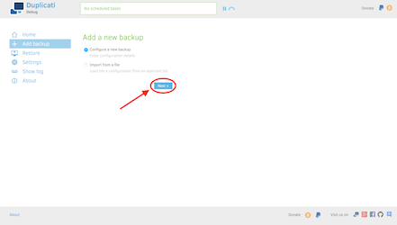
  </a>

## 3. Basic options

On the very first page, we need to choose a name for our backup. This can be anything you like, and is only used to find the backup later, in case you want to have many different backups.

The encryption methods are available from the dropdown with AES-256 pre-selected. Generally, you should encrypt your backups, but it is also possible to choose "No encryption" in case you are storing the files on a trusted location.

Rather than choosing a passphrase, you can click the "Generate" button and have a strong passphrase generated for you. If you generate a passphrase, make sure you write it down and store it in a safe place. If you lose this passphrase, you lose all access to your backup. 

Please note: There are no options for recovering a lost passphrase!

Once you have filled in the fields as you like, click the next button, or use the navigation in the top to choose the next step.

  <a href="../../images/quick-guide/page1-empty.png" data-sub-html="On the initial page, you can choose a name and encryption details. Click the &quot;Generate&quot; link to generate a strong passphrase to protect your data.">
      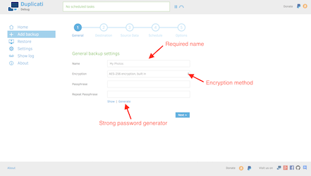
  </a>
  <a href="../../images/quick-guide/page1-filled.png" data-sub-html="Once filled, click the&quot;Next&quot; button to continue, or use the navigation in the top to select the next step.">
      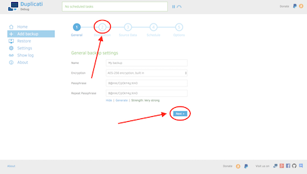
  </a>

## 4. Storage option

The next step is to choose where to store data. For this step, you need to have some information from your storage provider, such as a username and a password. If you have a network drive, or external hard-drive, you can also choose to store your data there. You will need to enter different values, depending on what storage provider you are using.

In this example, we are using a WebDAV based backend, which requires us to input a server name, a path on the server, as well as a username and password. If your storage provider has a Duplicati section, you can click the three dots to reveal a small menu that allows you to import a "connection url". Likewise, you can create a "connection url" for others to use via the export menu.

The "Test connection" button ensures that the information is entered correctly, and that your machine can connect to the storage destination.

As before, you can use the "Next" button or the navigation line at the top to choose the next step.

  

  <a href="../../images/quick-guide/page2-empty.png" data-sub-html="Each destination has different options.">
      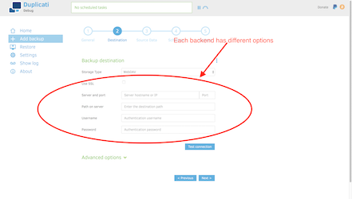
  </a>

  <a href="../../images/quick-guide/page2-menu-open.png" data-sub-html="The menu to import and export connection url's can be found under the three dots.">
      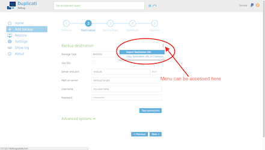
  </a>

  <a href="../../images/quick-guide/page2-import.png" data-sub-html="If your storage provider provides a Duplicati connection string, you can paste it here.">
      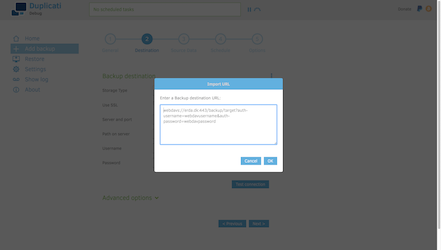
  </a>

  <a href="../../images/quick-guide/page2-filled.png" data-sub-html="After importing or typing the data, you can test the connection to verify it is working correctly.">
      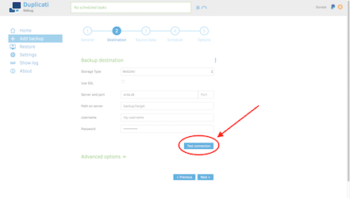
  </a>

  <a href="../../images/quick-guide/page2-export.png" data-sub-html="You can also export a connection string if you need to give it to someone else.">
      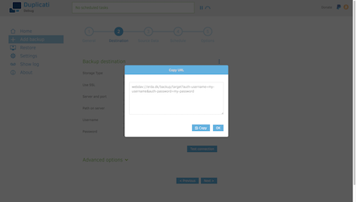
  </a>

## 5. Source data

In this step you must choose what files to make a backup of. Most users will only need to locate the desired folder in the tree, and check the desired folders. Subfolders to an included folder can be excluded by clicking the check mark. For advanced users, the three dots will enable a text display where each line is a folder or file to back up.

Exclusions based on attributes or file size can be configured under the "Exclude" section.

The filters section can be used to selectively exclude certain files or folders. You can read more about filters in the [detailed explanation of how filters work](../Filters).

As before, you can use the "Next" button or the navigation line at the top to choose the next step.

  <a href="../../images/quick-guide/page3-empty.png" data-sub-html="The source page lets you pick the data that is backed up.">
      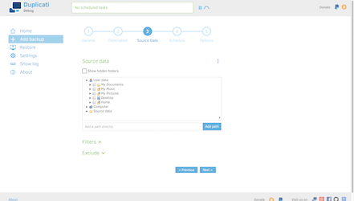
  </a>

  <a href="../../images/quick-guide/page3-filled.png" data-sub-html="Click the checkboxes for the data you want to include.">
      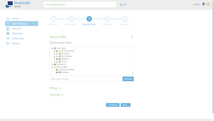
  </a>  

  <a href="../../images/quick-guide/page3-exclude-options.png" data-sub-html="Files can be excluded based on attributes and file size.">
      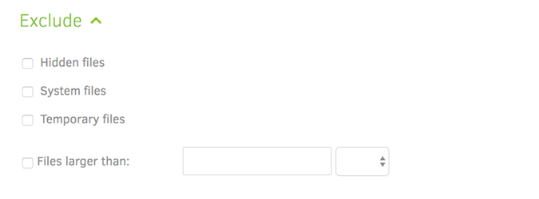
  </a>  

    

  <a href="../../images/quick-guide/page3-filters.png" data-sub-html="Filters can be used to exclude files and folders based on their names.">
      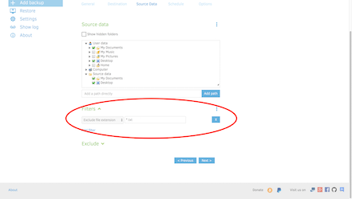
  </a>  

## 5. Schedule runs

The schedule step lets you set how frequent the backup runs. You can disable the schedule such that you can manually choose when the backup runs. But rather than forgetting to run the backup, we recommend that you setup a regular schedule.

If your computer is off or Duplicati is not running, Duplicati will automatically run the backup the next time it is started.

As before, you can use the "Next" button or the navigation line at the top to choose the next step.

  <a href="../../images/quick-guide/page4.png" data-sub-html="The schedule page lets you choose when to run the backup.">
      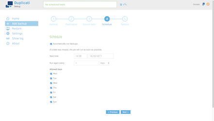
  </a>

## 6. More options

The final page lets you control how large files Duplicati will create on the remote storage. Feel free to leave this value to the default, or [read more about choosing file sizes](../Choosing-Sizes).

The other option on this page is about how far back you want to store old backups, sometimes called "retention". Backups older than the specified range will be deleted after a backup has completed. Deleting old backups can free up space on the remote destination. 

Please note: Duplicati will not free storage space immediately when you change the setting. This is because old backup data might be stored in the same file as current backup data. When the backup runs the next time, Duplicati will check if current backup data can be rearranged so that files can be deleted without uploading too much current data again.  

The "Advanced options" area lets you tinker with all the different special options that Duplicati supports. You should only use these options if you really know what you are doing.

Finally, you can click the "Save" button to store the backup configuration. If you have automatically generated a passphrase, you are now promted to write it down and keep it safe. If you lose the passphrase, you cannot recover the backup, and there is no way to recover your data.

  <a href="../../images/quick-guide/page5.png" data-sub-html="The options page lets you choose the volume size and the retention.">
      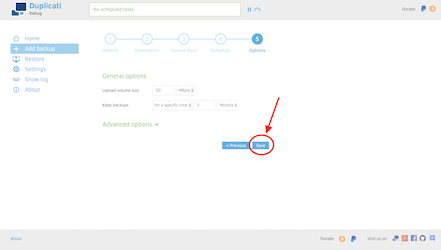
  </a>

  <a href="../../images/quick-guide/confirm-generated-passphrase.png" data-sub-html="If you have automatically generated a passphrase, you are now promted to write it down and keep it safe.">
      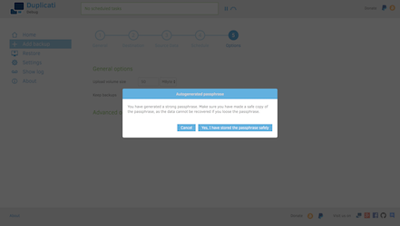
  </a>

## 7. Running the backup

Now that the backup is configured, you can let it be, and it will run at the scheduled time. If you are impatient, you can click the "Run now" link and have the backup run immediately.

  <a href="../../images/quick-guide/backup-configured.png" data-sub-html="After configuring the backup, you can wait until the scheduled time, or click the &quot;Run now&quot; link to start the backup immediately.">
      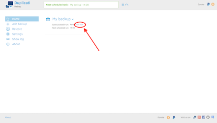
  </a>

## Questions

If you have questions, try asking on our [live Gitter channel](https://gitter.im/duplicati/Lobby), or one of our other [contact options](../../getintouch).
